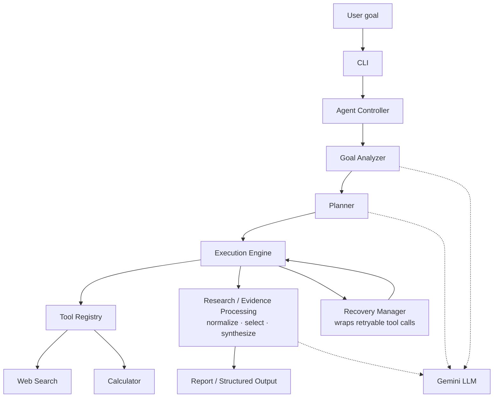

# Agentic Research Intelligence System

Python CLI agent that accepts a high-level research goal, plans and executes a fixed research pipeline with registered tools, recovers from retryable failures, and returns a structured `ResearchReport` with trace, findings, sources, and status.

## Overview

Researchers often start with an underspecified question—*what mattered in generative AI last week?*—and need a **sourced brief**, not an unstructured chat reply. This system turns a **natural-language goal** into a **validated, stepwise workflow**: structured goal analysis, a printed plan, sequential execution with visible trace lines, tool calls through a registry, evidence processing over search results, and a final report whose citations are checked against retrieved URLs.

The implementation is a **custom agentic pipeline** (no LangChain/LangGraph/CrewAI) built for an **AI engineering take-home assignment** (`PRD.md`). The LLM (Gemini) fills Pydantic schemas for analysis, planning, and synthesis; **Python** owns orchestration, tool I/O, retries, selection heuristics, and grounding.

## Key Capabilities

- **Natural-language goal analysis** — `GoalAnalyzer` extracts topic, time range, recency, requested item count, and output type.
- **Multi-step planning** — LLM `PlanDraft`, then `canonicalize_plan` enforces the execution contract.
- **Structured Gemini outputs** — `generate_structured` with JSON schema validation and bounded LLM retries (`LLM_MAX_RETRIES`).
- **Web search** — `ddgs` (default backend `duckduckgo`), up to five queries for time-bounded goals.
- **Calculator** — Safe `ast`-based arithmetic (no `eval`).
- **Tool registry** — `register`, `get`, `list_tools`; engine resolves tools only through the registry.
- **Research normalization** — Dedupe by URL/title; optional HTML fetch for promising URLs.
- **Candidate selection** — Topic, recency, event-language, and source heuristics; may return fewer than requested.
- **Page-level evidence** — Meta/JSON-LD/`<time>` dates and text excerpt for validation and synthesis context.
- **Failure simulation** — `--simulate-failure` raises `SimulatedTimeoutError` on the first search call.
- **Retry/recovery** — `RecoveryManager` with configurable `MAX_RETRIES` for retryable search errors.
- **Evidence-aware synthesis** — `ground_findings` drops citations not in the shortlist.
- **Structured final reports** — `ResearchReport` with `success` | `partial` | `failed`, execution summary, limitations.
- **CLI** — `python -m app`, optional `--output`, `--verbose`.
- **Automated tests** — Pytest with fakes/mocks (no live Gemini or DuckDuckGo in CI).

## Architecture



Recovery runs **inside** the execution engine around individual tool operations (especially `web_search`); it is not a separate post-pipeline stage. Gemini is accessed via `LLMClient`, not the tool registry.

### CLI

`app/cli.py` parses the goal and flags (`--simulate-failure`, `--output`, `--verbose`), loads settings (including optional `.env`), builds the LLM and registry, and runs `AgentController`. Exit code `0` only when `report.status == "success"`; `partial`/`failed` return `1`; missing API key returns `2`.

### Agent Controller

`app/controller.py` sequences goal analysis → planning → `ExecutionEngine.execute` → `build_report`, emitting trace sections for goal, plan, steps, and report.

### Goal Analyzer

`app/analysis/goal.py` calls Gemini with a fixed system prompt and returns `GoalAnalysis` (topic, `time_range`, `recency`, `requested_items`, `output_type`).

### Planner

`app/planning/planner.py` produces a `PlanDraft`, then `canonicalize_plan` reorders and fills steps to match `REQUIRED_TOOLS`: `web_search`, `normalize`, `select`, `calculator`, `synthesize`. Plan adjustments are recorded in report limitations when the draft differed.

### Execution Engine

`app/execution/engine.py` runs plan steps sequentially. Registry tools (`web_search`, `calculator`) go through recovery; stages (`normalize`, `select`, `synthesize`) run in-process. Critical step failure aborts later steps (`skipped`). Multi-query search merges results into `context.search_results`.

### Tool Registry

`app/tools/registry.py` holds named tools. The engine never imports search or calculator implementations directly at call sites.

### Web Search

`app/tools/web_search.py` wraps `DDGS().text()` with region, safesearch, `max_results`, `timelimit`, and backend. Results normalize to `SearchResult` (title, url, snippet, domain). Empty or unusable provider responses raise `EmptySearchError`. Optional `FailureSimulator` on first invocation.

### Calculator

`app/tools/calculator.py` evaluates a single arithmetic expression from the engine (source-diversity formula). Invalid or unsafe expressions raise `CalculatorError` (not retried by recovery).

### Recovery Manager

`app/execution/recovery.py` retries operations when `is_retryable_tool_error` is true: `SimulatedToolError` and `SearchNetworkError` (including `EmptySearchError`). Stops after `max_retries` and raises `RecoveryExhausted` with the original exception preserved.

### Report Generation

`app/report/builder.py` assembles `ResearchReport`: plan, per-step `StepSummary`, tools used, retry counts, findings, sources, limitations, and status. `write_report` optionally writes JSON via `--output`.

## Agent Workflow

1. User submits a research goal on the CLI.
2. **Goal Analyzer** returns structured requirements (`GoalAnalysis`).
3. **Planner** returns a five-step plan aligned to the required tool order (possibly adjusted from the LLM draft).
4. **Execution Engine** runs each step and prints `[STEP i/5]` trace lines.
5. **Web search** runs up to five focused queries (when recency is set), each with an appropriate `timelimit`, and aggregates `SearchResult` rows.
6. **Normalize** (`prepare_candidates`) deduplicates results and fetches HTML evidence for promising URLs (`page_title`, `publication_date`, `page_excerpt`).
7. **Select** (`select_candidates`) applies disqualification and scoring; zero qualifiers raise `PipelineError` (failed run, no fabricated findings).
8. **Calculator** computes `(unique domains / normalized count) × 100` as a descriptive diversity statistic.
9. **Synthesize** calls Gemini with shortlist context; **grounding** removes findings whose URLs were not retrieved.
10. **Report** is printed to the terminal and optionally saved as JSON; CLI exit code reflects `success` vs `partial`/`failed`.

## Tooling

| Tool | Purpose | Why it exists |
|------|---------|---------------|
| Web Search | Retrieve external research sources via `ddgs` | Supplies live public URLs, titles, and snippets for the pipeline |
| Calculator | Evaluate a deterministic arithmetic expression | Performs numeric work without LLM arithmetic; satisfies multi-tool requirement |
| Gemini (`google-genai`) | Goal analysis, planning, synthesis | Handles language understanding and prose generation under Pydantic schemas |

Registry tools: **Web Search** and **Calculator** only. Gemini is wired through `LLMClient` in analysis, planning, and synthesis.

## Reliability & Failure Recovery

**Detection** — Tool and stage failures surface as exceptions; the engine records `StepSummary` with `error` text and emits `[ERROR]` lines. Synthesis failures include the underlying type and message via `_public_error`.

**Bounded retries** — `RecoveryManager` allows at most `MAX_RETRIES` (default `2`) additional attempts per recovered operation. Retry count is aggregated on the report.

**Empty search** — `EmptySearchError` subclasses `SearchNetworkError` and is **retryable**. `WebSearchTool` also raises `EmptySearchError` when normalization yields zero usable rows, so an empty provider response is **not** treated as success.

**Simulated failure** — With `--simulate-failure`, the first `web_search` `run` raises `SimulatedTimeoutError` before the network; the next attempt uses the real search function.

**Insufficient evidence** — If `select_candidates` returns nobody, the select stage fails with `PipelineError`; later steps are skipped. The report status is `failed` with no findings rather than invented results. Fewer grounded findings than requested yields `partial` and explicit limitations.

**Non-retryable** — Default recovery does not retry `CalculatorError`, `SearchProviderError`, `MalformedSearchError`, `ToolInputError`, or `PipelineError`. LLM schema failures use a separate retry path inside `GeminiLLM` (`LLM_MAX_RETRIES`), then fail the run.

**Chained errors** — `RecoveryExhausted` and trace output retain the original exception (`exc.original` / `__cause__` where applicable).

This is assignment-scoped error handling, not a claim of production-grade fault tolerance.

## Evidence Handling

Pipeline (implemented in `app/research/`):

```text
Search (multiple queries)
  → Deduplicate (URL + title)
  → Normalize / prepare_candidates
  → Fetch promising pages (HTTP, capped bytes)
  → Extract publication metadata + excerpt
  → Score / select candidates (topic, recency, event, source)
  → Synthesize with shortlist-only URLs
  → Ground findings (drop uncited URLs)
```

**Dates** — `publication_date` from page meta, JSON-LD, or `<time>` is the primary recency signal for scoring and disqualification. **Event-linked** dates (text near verbs such as *announced* / *launched*) are parsed separately; arbitrary historical years in body text are not treated like a fresh publication date. Heuristics can still reject stale event stories or accept nothing when evidence is thin—accuracy is not guaranteed.

**Promising URLs** — Enrichment runs for reputable/primary domains or when topic tokens appear in title/snippet; others remain snippet-only.

## Example Execution

```bash
python -m app "Find the top 3 developments in generative AI from last week"
```

The CLI accepts any natural-language goal; topic and time window are inferred by the goal analyzer. Captured transcripts in `examples/` used the equivalent phrasing *Research the top 3 developments in generative AI from the last week.*

Failure simulation:

```bash
python -m app "Research the top 3 developments in generative AI from the last week." --simulate-failure
```

JSON report:

```bash
python -m app "Research the top 3 developments in generative AI from the last week." --output report.json
```

**Live outcomes** — Saved runs in [`examples/`](examples/) include **`partial`** (one of three findings) and **`failed`** (search succeeded, selection found no qualifying candidates). No live capture in this repo reached **`success`** (three grounded in-window findings); mocked tests assert the full success path.

Abbreviated trace shape:

```text
[GOAL] …
[PLAN] …
[STEP 1/5]
[TOOL] web_search
[SUCCESS] N results retrieved from 5 queries
[STAGE] normalize
[STAGE] select
[TOOL] calculator
[STAGE] synthesize
[REPORT]
Status: partial | failed | success
```

## Installation

Requires **Python 3.11+** (`pyproject.toml`).

```bash
python -m venv .venv
# Windows PowerShell: .venv\Scripts\Activate.ps1
python -m pip install -r requirements.txt
```

Dependencies: `pydantic`, `google-genai`, `ddgs`, `pytest` (see `requirements.txt`).

## Configuration

| Variable | Required | Default | Purpose |
|----------|----------|---------|---------|
| `GEMINI_API_KEY` | Yes (live runs) | — | Gemini API access |
| `GEMINI_MODEL` | No | `gemini-2.5-flash` | Model id |
| `MAX_RETRIES` | No | `2` | Tool recovery budget |
| `LLM_MAX_RETRIES` | No | `2` | Structured-output retries |
| `SEARCH_MAX_RESULTS` | No | `8` | Per-query result cap |
| `SEARCH_BACKEND` | No | `duckduckgo` | `ddgs` backend (`auto` fallback on empty) |

Optional `.env` in the project root is loaded by `app/config.py` if present. **Do not commit `.env`** (listed in `.gitignore`).

## Testing

```bash
python -m pytest
```

Tests use scripted LLMs and stubbed search; they do not require network access or API keys for the default suite.

## Documentation & samples

- [docs/architecture.md](docs/architecture.md) — Diagrams and module boundaries  
- [docs/design-writeup.md](docs/design-writeup.md) — Design rationale and limitations  
- [examples/](examples/) — Verbatim terminal transcripts (`partial`, `failed`, recovery demo)  
- [PRD.md](PRD.md) — Assignment specification  

## Limitations

- Search quality and availability depend on `ddgs` and the public index; intermittent `EmptySearchError` is expected in live use.
- Page evidence is a partial HTML fetch, not full article extraction or paywall bypass.
- Selection and date rules are heuristics; strict recency can yield zero candidates despite many search hits.
- Gemini quota errors (`429`) can fail synthesis; the trace should show the provider error.
- Calculator output is domain diversity, not relevance or importance.
