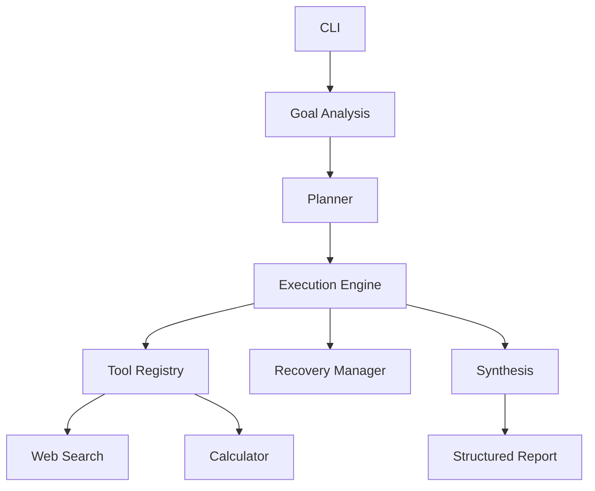

# Research Intelligence Agent

A command-line **agentic research workflow** (take-home implementation per `PRD.md`). You give a natural-language goal; the system analyzes it, prints a plan, runs that plan with tools, recovers from retryable failures, and produces a structured `ResearchReport` with findings, sources, limitations, and status.

The LLM (Gemini) proposes structured goal analysis, plan text, and synthesis drafts. **Python** owns validation, tool calls, retries, page-evidence fetch, candidate selection, citation grounding, and final status. No LangChain/LangGraph/CrewAI.

## Problem and use case

Turn requests like *“Research the top 3 developments in generative AI from the last week”* into a **traceable, sourced brief**. The topic and time window come from the user’s wording (not hard-coded). The same pipeline works for robotics, cybersecurity, cloud computing, and similar goals.

## Architecture



Module-level detail, sequence diagrams, and responsibility table: [docs/architecture.md](docs/architecture.md).  
One-page design notes: [docs/design-writeup.md](docs/design-writeup.md).

```text
CLI → AgentController
        → GoalAnalyzer (Gemini → GoalAnalysis)
        → Planner (Gemini → Plan, canonicalized to 5 steps)
        → ExecutionEngine
              → RecoveryManager (bounded retries)
              → ToolRegistry → web_search | calculator
              → research stages: normalize → select → synthesize
        → Report builder → terminal + optional JSON
```

## Agent workflow

1. **Goal analysis** — Extract topic, `time_range`, `recency`, requested count, output type.
2. **Planning** — LLM draft plan; `canonicalize_plan` enforces: `web_search` → `normalize` → `select` → `calculator` → `synthesize`.
3. **Execution** — Visible trace: `[GOAL]`, `[PLAN]`, `[STEP i/5]`, `[TOOL]` / `[STAGE]`, `[SUCCESS]` / `[ERROR]` / `[RECOVERY]`, `[REPORT]`.
4. **Search** — Up to five time-bounded queries per goal; results merged.
5. **Normalize** — Dedupe URLs/titles; fetch HTML evidence for promising domains (meta dates, excerpt).
6. **Select** — Heuristic shortlist (topic, recency, event language, source quality); may return fewer than requested.
7. **Calculator** — Domain diversity percentage over normalized results.
8. **Synthesize** — LLM findings; URLs not in the shortlist are dropped.
9. **Report** — `success` | `partial` | `failed` plus limitations.

## Tools (why these two)

| Tool | Implementation | Why |
| --- | --- | --- |
| **web_search** | `ddgs` → DuckDuckGo (`SEARCH_BACKEND`, default `duckduckgo`) | Live public evidence for research goals without a paid search API. |
| **calculator** | `ast` literal evaluation | Deterministic numeric step in the plan; demonstrates a second tool and safe expression evaluation (no `eval`). |

All tools are obtained only through `ToolRegistry`.

## Failure and recovery

- **`--simulate-failure`** — First `web_search` raises `SimulatedTimeoutError` before the network (PRD failure simulation).
- **Retryable errors** — Simulated timeout, network/timeout errors, `EmptySearchError` (no usable results). Retried up to **`MAX_RETRIES`** (default 2) via `RecoveryManager`.
- **Trace** — `[ERROR] <ExceptionName>`, `[RECOVERY] Attempting recovery...`, `[RECOVERY] Retry n/N`, then a repeated `[TOOL] web_search` on success.
- **Non-retryable** — Invalid tool input, exhausted retries, failed select/synthesis where retry would not help.

See [examples/simulate_failure_recovery.md](examples/simulate_failure_recovery.md) for a real capture.

## Setup and environment variables

Create a virtual environment and install dependencies (Python **3.11+**):

```powershell
python -m venv .venv
.venv\Scripts\Activate.ps1
python -m pip install -r requirements.txt
```

Copy secrets locally (never commit `.env`; it is in `.gitignore`):

| Variable | Required | Default | Purpose |
| --- | --- | --- | --- |
| `GEMINI_API_KEY` | Yes for live runs | — | Gemini API key |
| `GEMINI_MODEL` | No | `gemini-2.5-flash` | Model id for `google-genai` |
| `MAX_RETRIES` | No | `2` | Tool recovery attempts |
| `LLM_MAX_RETRIES` | No | `2` | Retries on invalid structured LLM JSON |
| `SEARCH_MAX_RESULTS` | No | `8` | Max rows per query |
| `SEARCH_BACKEND` | No | `duckduckgo` | `ddgs` backend name |

PowerShell:

```powershell
$env:GEMINI_API_KEY = "your-key"
```

Optional `.env` in the project root is loaded by `app/config.py` if present (existing shell variables take precedence).

## Run commands

```powershell
python -m app "Research the top 3 developments in generative AI from the last week."
python -m app "Research the top 3 developments in robotics from the last week."
python -m app "Research the top 3 developments in generative AI from the last week." --simulate-failure
python -m app "Research the top 3 developments in generative AI from the last week." --output report.json
python -m app "..." --verbose
python -m app --help
```

### Exit codes

| Code | Meaning |
| ---: | --- |
| 0 | Report status `success` |
| 1 | `partial` or `failed`, or provider error |
| 2 | Bad CLI args or missing `GEMINI_API_KEY` |

## Testing

Tests use mocks/fakes—no live Gemini or DuckDuckGo:

```powershell
python -m pytest
```

## Sample transcripts

Real terminal captures (not fabricated) live in [examples/](examples/). Summary:

| File | Status | Notes |
| --- | --- | --- |
| [partial_run_generative_ai.md](examples/partial_run_generative_ai.md) | `partial` | Pipeline completed; 1 of 3 findings |
| [simulate_failure_recovery.md](examples/simulate_failure_recovery.md) | `failed` | Shows simulated timeout + search recovery |
| [failed_run_insufficient_evidence.md](examples/failed_run_insufficient_evidence.md) | `failed` | Search succeeded; select found no qualifying candidates |

During submission prep, **no live run produced `success`** (three in-window grounded findings). Outcomes depend on search results and selection on the day of the run. Full pipeline success is asserted in `tests/test_cli.py` and related tests with doubles.

## Limitations

- Search coverage is whatever `ddgs` returns for five queries; empty or noisy results happen in production.
- Page evidence is a capped HTML fetch (meta/`time`/JSON-LD dates + text excerpt), not full article extraction.
- Selection is heuristic (topic overlap, publication and event-linked dates, event verbs, domain lists)—not an objective “top N.”
- Calculator output is **domain diversity %**, not importance.
- Gemini free-tier quotas can cause synthesis failures (`429`); the trace reports the underlying error.
- Grounding removes findings that cite URLs that were not retrieved.

## Design decisions

- **Custom orchestration** instead of agent frameworks so planning, registry, recovery, and report shape stay visible and testable.
- **Structured outputs** (Pydantic + Gemini JSON schema) for goal, plan, and synthesis; invalid responses retry, then fail closed.
- **Canonical five-step plan** so the model cannot skip search or synthesis.
- **Deterministic failure simulation** on search only, for demos and tests.
- **Citation grounding** so the model cannot invent sources.
- **`partial` status** when some but not all requested findings are supported—honest reporting vs. padding.

## Project layout

```text
app/           CLI, controller, analysis, planning, execution, tools, research, report, llm
docs/          architecture.md, design-writeup.md
examples/      real run transcripts
tests/         pytest suite
PRD.md         assignment specification
requirements.txt
pyproject.toml
```

## License / submission

Built as an engineering take-home. Do not commit API keys or `.env`.
