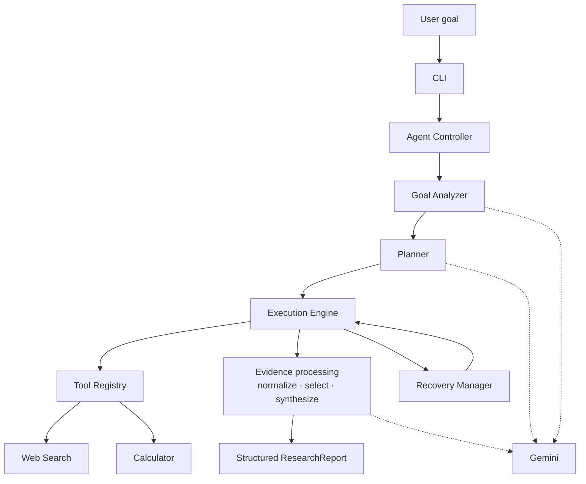

# Agentic Research Intelligence System

Command-line agent that accepts a natural-language research goal, **plans** the work, **executes** registered tools with a visible trace, **recovers** from retryable failures, **grounds** findings in retrieved evidence, and returns a structured **`ResearchReport`** (`success`, `partial`, or `failed`).

## Engineering Highlights

- Custom agent orchestration without LangChain, LangGraph, or CrewAI
- Structured LLM outputs using Pydantic schemas (goal, plan, synthesis)
- Registry-based tool execution (`web_search`, `calculator`)
- Bounded retry and failure recovery (`RecoveryManager`, `--simulate-failure`)
- Evidence-aware research pipeline (search → normalize → select → synthesize)
- Explicit `partial` / `failed` states instead of fabricated results
- Automated tests with mocked external dependencies (no live Gemini or search in the default suite)

## Overview

The system turns underspecified research questions into a short, sourced brief with an audit trail. One goal string drives the full run: **Goal Analyzer** and **Planner** (Gemini) produce structured intent and steps; the **Execution Engine** runs **Web Search**, research stages, and **Calculator** through the **Tool Registry**; **Recovery Manager** handles retryable tool errors; synthesis is checked against the retrieved shortlist before **Report** output.

Built for an AI engineering take-home ([`PRD.md`](PRD.md)). Topic and time window come from the user’s wording, not a hard-coded domain. Python owns orchestration, tool I/O, evidence handling, and grounding; the model does not call tools directly. Deeper module notes live in [`docs/design-writeup.md`](docs/design-writeup.md) and [`docs/architecture.md`](docs/architecture.md).

## Architecture



| Component | Role |
|-----------|------|
| **CLI** | Arguments, settings, exit codes |
| **Agent Controller** | Analyze → plan → execute → report |
| **Goal Analyzer** | Structured goal fields from natural language |
| **Planner** | Plan draft, then fixed five-step contract |
| **Execution Engine** | Sequential steps and terminal trace |
| **Tool Registry** | Lookup for `web_search` and `calculator` |
| **Web Search** | `ddgs` queries and normalized results |
| **Calculator** | Deterministic arithmetic for the diversity metric |
| **Recovery Manager** | Bounded retries on retryable tool errors |
| **Evidence processing** | Dedupe, page fetch, selection, synthesis |
| **Report** | `ResearchReport` terminal view and optional JSON |

Recovery wraps retryable registry tool calls inside the engine. Gemini is used via `LLMClient`, not the registry.

## How the Agent Works

1. User submits a goal on the CLI.
2. **Goal Analyzer** produces structured requirements (topic, time range, recency, count, output type).
3. **Planner** proposes steps; the plan is aligned to: search → normalize → select → calculator → synthesize.
4. **Execution Engine** prints `[GOAL]`, `[PLAN]`, `[STEP i/5]`, and per-step tool/stage lines.
5. **Web Search** runs multiple focused queries when a time window is set; results are merged.
6. **Normalize** deduplicates and enriches promising URLs with page evidence.
7. **Select** shortlists candidates; if none qualify, the run fails without invented findings.
8. **Calculator** evaluates source-domain diversity over the normalized set.
9. **Synthesize** drafts findings; URLs not in the shortlist are removed.
10. **Report** summarizes status, findings, sources, and limitations; exit code `0` only when status is `success`.

## Tools & Orchestration

| Piece | Role |
|-------|------|
| **Web Search** | Live public sources via `ddgs` |
| **Calculator** | Safe expression evaluation (no `eval`) |
| **Gemini** | Goal analysis, planning, synthesis |
| **normalize / select / synthesize** | In-process stages in `app/research/` |

All registry tools are resolved through **Tool Registry**; stages update shared run context between steps.

## Reliability & Failure Recovery

| Topic | Behavior |
|-------|----------|
| Retryable | Simulated search timeout, network-style search errors, empty unusable search results |
| Budget | `MAX_RETRIES` (default `2`) per recovery-wrapped operation |
| Simulation | `--simulate-failure` fails the first search call, then retries against the real tool |
| Empty results | Treated as failure, not success |
| Exhausted retries | Step marked failed; original error retained |
| Critical steps | Failure on search, normalize, select, or synthesize skips later steps |
| Thin evidence | `partial` or `failed`; no padding with unsupported claims |
| LLM schema | Separate retry limit via `LLM_MAX_RETRIES` |

Synthesis failures include the underlying error type in the trace when available.

## Evidence & Grounding

```text
Search → dedupe → fetch promising pages → extract dates and excerpt
  → select candidates → synthesize → keep only shortlist URLs
```

Publication metadata and excerpts support recency and event checks. Date handling distinguishes publication signals from event-linked phrases in text; rules are heuristic. Grounding drops citations that were not part of the retrieved set.

## Example Execution

```bash
python -m app "Find the top 3 developments in generative AI from last week"
```

```bash
python -m app "Research the top 3 developments in generative AI from the last week." --simulate-failure
python -m app "Research the top 3 developments in generative AI from the last week." --output report.json
python -m app --help
```

Recorded live runs in [`examples/`](examples/) include **`partial`** (one of three findings) and **`failed`** (no qualifying candidates after search). **No live transcript in this repository reached full `success`** (three grounded in-window findings). The pytest suite covers the success path with mocks.

## Installation

Python **3.11+** (`pyproject.toml`).

```bash
python -m venv .venv
# Windows: .venv\Scripts\Activate.ps1
python -m pip install -r requirements.txt
```

## Configuration

| Variable | Required | Default | Purpose |
|----------|----------|---------|---------|
| `GEMINI_API_KEY` | Live runs | — | Gemini API key |
| `GEMINI_MODEL` | No | `gemini-2.5-flash` | Model id (`DEFAULT_MODEL` in `app/config.py`) |
| `MAX_RETRIES` | No | `2` | Tool recovery attempts |
| `LLM_MAX_RETRIES` | No | `2` | Invalid structured-output retries |
| `SEARCH_MAX_RESULTS` | No | `8` | Per-query cap |
| `SEARCH_BACKEND` | No | `duckduckgo` | `ddgs` backend (`auto` fallback once on empty) |

Optional `.env` at the project root is loaded by `app/config.py` (shell env wins). Do not commit `.env` (see `.gitignore`).

## Testing

```bash
python -m pytest
```

**83** tests collected; uses fakes and mocks—no network or API key required for the default run.

## Project Structure

```text
PRD.md
README.md
requirements.txt
pyproject.toml
app/
  cli.py, controller.py, config.py, models.py
  analysis/          Goal Analyzer
  planning/          Planner
  execution/         Execution Engine, Recovery Manager
  tools/             Tool Registry, Web Search, Calculator
  research/          Evidence processing
  report/            ResearchReport builder
  llm/               Gemini client
tests/
docs/                architecture.md, design-writeup.md
examples/            Verbatim CLI transcripts
```

## Design Decisions

- Visible planner, registry, and recovery instead of a black-box agent framework
- Canonical five-step plan so search and synthesis cannot be skipped silently
- Two registry tools plus deterministic calculator step
- Citation grounding on the shortlist only
- `partial` when fewer findings than requested are supported by evidence
- Vendor SDKs confined to `app/llm/` and `app/tools/web_search.py`

## Limitations

- Public search via `ddgs` is noisy; `EmptySearchError` and weak recall happen in production.
- Page evidence is partial HTML, not full article parsing or paywall access.
- Selection and date rules are heuristics; many hits can still yield zero candidates.
- Gemini quota (`429`) can block synthesis on free tiers.
- Calculator metric is domain diversity, not importance or quality.
- Live outcomes vary by day; documented examples include `partial` and `failed` only.

## Documentation

- [`docs/architecture.md`](docs/architecture.md) — Diagrams, step states, failure injection
- [`docs/design-writeup.md`](docs/design-writeup.md) — Narrative design notes
- [`examples/`](examples/) — Captured run transcripts
- [`PRD.md`](PRD.md) — Assignment specification

## Future Improvements

- Structured event log alongside terminal trace
- Optional cache for search and page evidence to stabilize demos
- Licensed news APIs where appropriate
- Tighter recency/event detection without over-rejecting current articles
- Optional human approval before synthesis for high-stakes use
