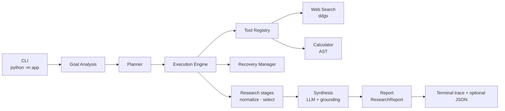
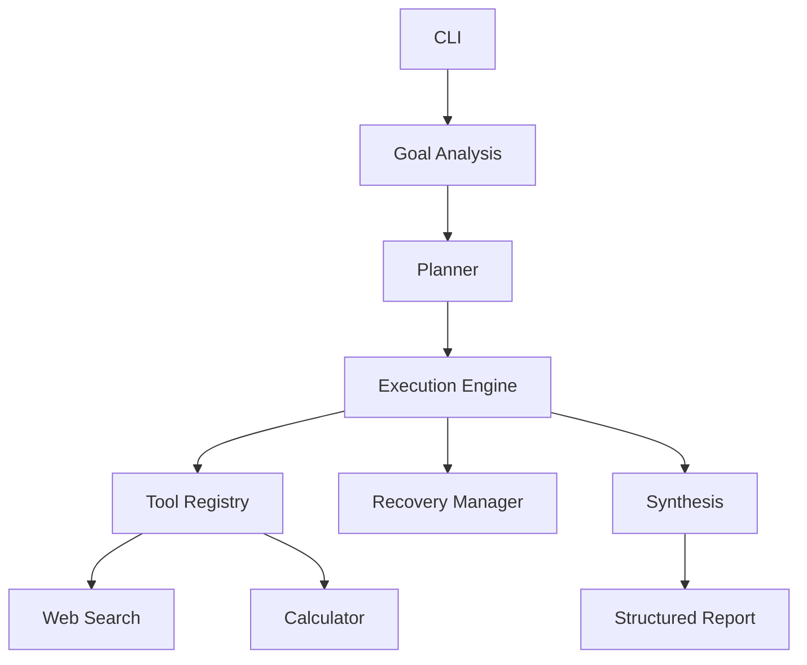
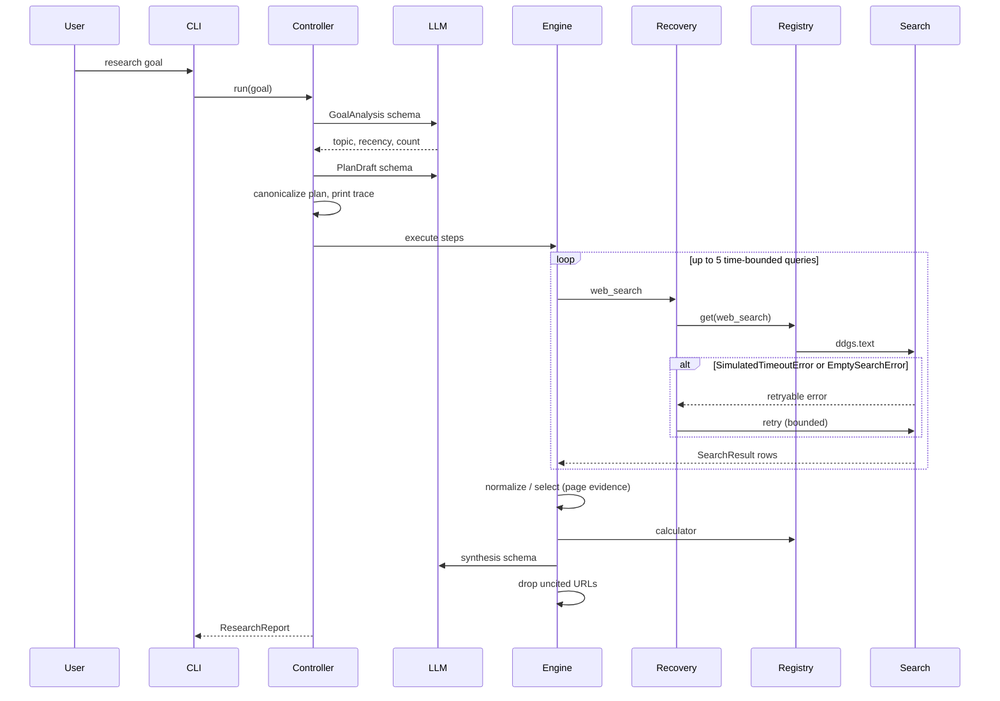

# Architecture

The agent is a fixed pipeline. The language model fills structured slots. Python decides what runs, in what order, and what is allowed to retry.

## Component diagram

Equivalent linear view (assignment checklist):

Recovery wraps retryable tool calls inside the execution engine (search and registry tools), not as a separate post-step.

## Sequence (search failure)

## Responsibilities

| Module | Owns | Does not own |
| --- | --- | --- |
| `app/cli.py` | Arguments, exit codes, wiring | Research heuristics |
| `app/controller.py` | Analysis → plan → execute → report order | Tool implementations |
| `app/analysis/goal.py` | `GoalAnalysis` prompt and schema | Execution |
| `app/planning/planner.py` | Plan schema and required step order | Calling tools |
| `app/execution/engine.py` | Step state, trace, multi-query search | Vendor SDKs |
| `app/execution/recovery.py` | Retry budget, preserve root error | Printing |
| `app/tools/registry.py` | `register`, `get`, `list_tools` | When a tool runs |
| `app/tools/web_search.py` | `ddgs`, normalization, failure injection | Candidate ranking |
| `app/tools/calculator.py` | Safe arithmetic | Importance scoring |
| `app/research/` | Queries, dedupe, page fetch, selection, synthesis, grounding | LLM vendor |
| `app/report/builder.py` | `ResearchReport` and JSON export | Model calls |
| `app/llm/gemini.py` | `google-genai` structured output | Application state |

## Step states

Each step is `pending`, then `running`, then one of `success`, `recovered`, `failed`, or `skipped`. A recovered step is a retryable failure followed by a successful call. The trace prints `[ERROR]`, `[RECOVERY]`, and later `[SUCCESS]`.

## Failure injection

`--simulate-failure` attaches a `FailureSimulator` to the search tool. The first `run` raises `SimulatedTimeoutError` before the network. `RecoveryManager` retries up to `MAX_RETRIES`. The sequence is deterministic for tests and demos.

## Structured outputs from the model

- Goal: topic, time range, recency, requested item count, output type.
- Plan: ordered steps (canonicalized to search → normalize → select → calculator → synthesize).
- Synthesis: findings with `source_urls` from the shortlist, plus limitations.

Tool payloads are built in Python. Invalid JSON or schema failures retry up to `LLM_MAX_RETRIES`, then fail the run.
